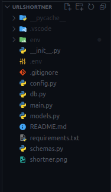
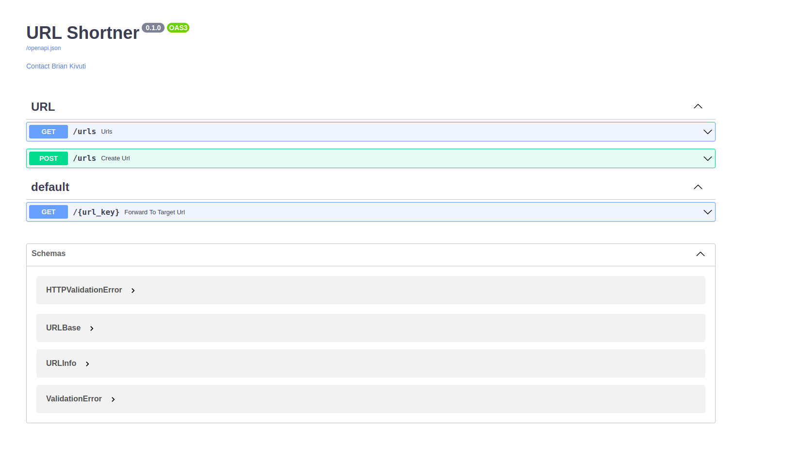

# URL Shortner

## Features

*  FastAPI
*  Pydantic
*  SQLALCHEMY
*  Swagger

## Installation

1. Clone this repository
2. Create a virtual environment

    ```
    python -m venv env
    ```

3. Activate virtual environment in parent directory of your "env"

    For Linux and MAC

    ```
    source env/bin/activate
    ```

    For Windows

    ```
    env\Scripts\activate.bat
    ```

4. Install the requirements

    ```
    pip install -r requirements.txt
    ```

5. Create an environment variables. create a ***.env*** file. The File should have the following environment variables

    ```
    PROJECT_NAME=
    CONTACT_NAME=
    CONTACT_EMAIL=
    BASE_URL=
    DB_URL=sqlite:///./urlshortner.db
    ```

    Your project structure should look as follows

    
    

6. To run the code
    ```
    uvicorn main:app --reload
    ```

7. Open Browser and view the swagger docs

    

    To Create a url shortner, make a post request on ***/urls***

8. Sample payload 

    ```
    {
        "target_url": "http://www.techcamp.co.ke"
    }
    ```

    Sample response

    ```
    {
        "target_url": "http://www.techcamp.co.ke",
        "is_active": true,
        "clicks": 0,
        "expire_datetime": "2022-11-11T16:17:22.093225",
        "url": "http://localhost:8000/VEHT"
    }
    ```

    Visit the url generated and it would redirect to the ***target_url***